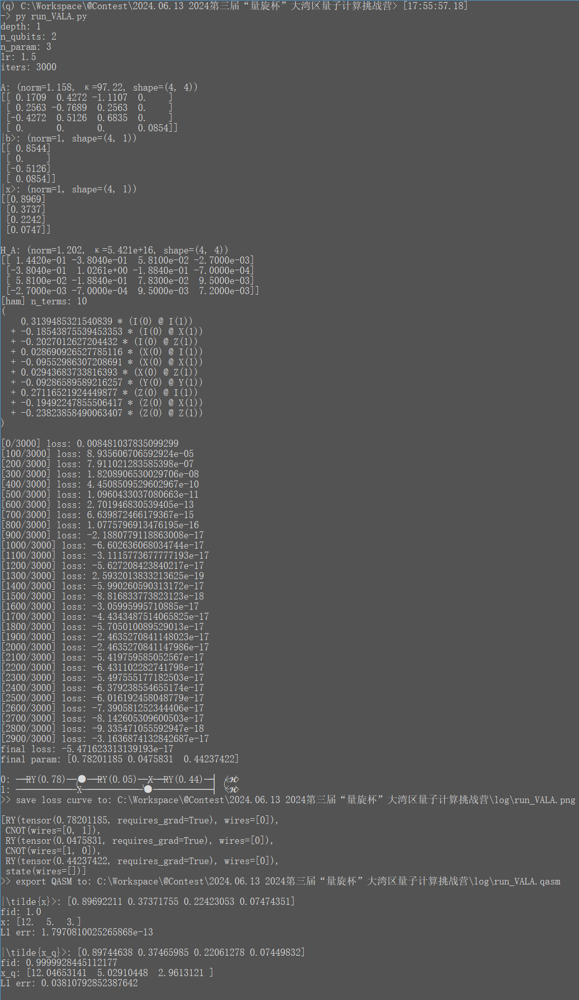

# VQLS-JiuZhang-PennyLane

    Contest solution for 2024第三届“量旋杯”大湾区量子计算挑战营

----

Contest page: [https://quantum-challenge.spinq.cn/competitionDetail/profession](https://quantum-challenge.spinq.cn/competitionDetail/profession)  
Team Name: 啊这是什么吃一口  

⚠ Due to the contest problem case is rather simple, the implemented method is actually the [VALA (arXiv:1909.03898)](https://arxiv.org/abs/1909.03898), **NOT** the more complicated [VQLS (arXiv:1909.05820)](https://arxiv.org/abs/1909.05820v4) 😈; but we do carefully explain the differences between these methods in [METHOD.md](./METHOD.md)


### Problem

```
[原题 - 出自《九章算术·方程·8》]
今有卖牛二、羊五，以买一十三豕，有余钱一千；
卖牛三、豕三，以买九羊，钱适足；
卖六羊，八豕，以买五牛，钱不足六百。
问：牛、羊、豕价各几何？
答曰：牛价一千二百，羊价五百，豕价三百。

[线性方程组]
 2 * x + 5 * y - 13 * z = 1000
 3 * x - 9 * y +  3 * z = 0
-5 * x + 6 * y +  8 * z = -600
解：牛 x = 1200, 羊 y = 500, 豕 z = 300
```

赛题本质为给定的**线性方程组求解**，其同解方程组为：

$$
\begin{array}{ll}
\begin{bmatrix}
   2 &  5 & -13 \\
   3 & -9 &   3 \\
  -5 &  6 &   8 \\
\end{bmatrix} \begin{bmatrix}
  12 \\
  5 \\
  3 \\
\end{bmatrix} = \begin{bmatrix}
  10 \\
  0 \\
  -6 \\
\end{bmatrix}
\end{array}
$$

已知的 **量子线性求解器 Quantum Linear-system Solver** 算法流派有：

- HHL / QPE-based
  - 需要矩阵指数化 $ e^{iA\frac{t0}{2^k}} $
  - 受控旋转部分 $ CR $ 角度难以确定
  - 精度由qubit位数 / 线路宽度决定
- Adiabatic-based: 绝热演化
  - 需要虚时演化算子 $ e^{-iHt} $，或一阶近似后使用 BlockEncoding
  - 精度由迭代次数 / 线路深度决定
- VQLS: 变分线路 ⭐
  - 浅线路，需要变分训练
  - 精度由 ansatz 结构和参数质量决定
- qubo-based VQE (思路提供者: 铅笔芯奇)
  - 解向量中的每个元素 $ x_i $ 转为二进制形式 $ \overline{b_k \dots b_1 b_0} $ ，由一组量子比特表达 (BasisEncoding)
  - 原方程转换为 QUBO 问题，构造哈密顿量求最小值，取得最小值时即解出各 $ b_k $
    - [How to solve QUBO problems using Qiskit](https://medium.com/@shoaib6174/how-to-solve-qubo-problems-using-qiskit-f4eab6cc3061)
    - [QUBO, Ising Hamiltonians and VQA](https://quantumcomputing.stackexchange.com/questions/14098/qubo-ising-hamiltonians-and-vqa)
    - 可以视作一种**稀疏表达**版本的 VQLS
  - 优点: 若每个 $ x_i $ 表达为二进制时都是有穷串，则此方法可给出 **精确解** (此时损失函数应取到最小值0)
  - 缺点: 需要先验地知道每个 $ x_i $ 的值域，以确定用多少比特表达
- Grover-based (?)

考虑到赛题对所用量子门和线路深度的限制，**VQLS** 方法应该是唯一正解 🤔


### Quick start

- `pip install pennylane`
- run `submit.ipynb` with jupyter
  - run `python run_VALA.py` if you wanna reproduce the training
  - read [METHOD.md](./METHOD.md) for the theoretical story
- run `submit_ising.ipynb` with jupyter, we owe the raw idea to @铅笔芯奇
  - I must admit that `VALA` method is more like a simulator toy, while the `ising` method is more practical & promising on real-chip and the future!

Example of `run_VALA.py` run:




#### refenrence

- essay & notes
  - (2019) Variational algorithms for linear algebra: [https://arxiv.org/abs/1909.03898](https://arxiv.org/abs/1909.03898)
  - (2019) Variational Quantum Linear Solver: [https://arxiv.org/abs/1909.05820v4](https://arxiv.org/abs/1909.05820v4)
  - (2021) Variational Quantum Linear Solver with Dynamic Ansatz： [https://arxiv.org/abs/2107.08606](https://arxiv.org/abs/2107.08606)
  - VQLS 变分量子算法解线性方程组: [https://blog.csdn.net/qq_43550173/article/details/121591659](https://blog.csdn.net/qq_43550173/article/details/121591659)
  - Hadamard Test 以及 controlled gate 的一个细节: [https://zhuanlan.zhihu.com/p/412446869](https://zhuanlan.zhihu.com/p/412446869)
- implementaions
  - PennyLane - Variational Quantum Linear Solver: [https://pennylane.ai/qml/demos/tutorial_vqls/](https://pennylane.ai/qml/demos/tutorial_vqls/)
  - Qiskit VQLS tutorial: [https://github.com/qiskit-community/qiskit-textbook/blob/main/content/ch-paper-implementations/vqls.ipynb](https://github.com/qiskit-community/qiskit-textbook/blob/main/content/ch-paper-implementations/vqls.ipynb)
  - VQLS 的 MindQuantum 复现: [https://www.cnblogs.com/liniganma/p/17323717.html](https://www.cnblogs.com/liniganma/p/17323717.html)
  - PaddlePaddle-Quantum VQLS: [https://github.com/PaddlePaddle/Quantum/blob/master/applications/linear_solver/introduction_cn.ipynb](https://github.com/PaddlePaddle/Quantum/blob/master/applications/linear_solver/introduction_cn.ipynb)
- related solution
  - Adiabatic-Linear-Solver-QPanda: [https://github.com/Kahsolt/Adiabatic-Linear-Solver-QPanda](https://github.com/Kahsolt/Adiabatic-Linear-Solver-QPanda)

----
by Armit
2024/6/13
