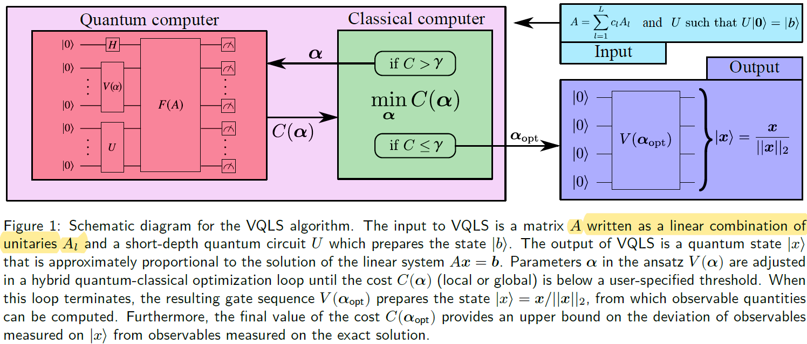

### VQLS in brief

- 使用线路 $ U $ 来制备态 $ \left| b \right> $，即 $ \left| b \right> = U \left| 0 \right> $
- 使用可学习的含参线路 $ V(\alpha) $ 来制备目标态 $ \left| x \right> $，即 $ \left| x(\alpha) \right> = V(\alpha) \left| 0 \right> $
- 将系数矩阵 $ A $ 编码为一个 Oracle (其实是 Block-encoding)，即 $ F(A) $ 以实现矩阵乘法 $ \left| \psi \right> \sim A \left| x(\alpha) \right> $
- 引入一个辅助比特以实现 Hadamard Test，比较两个态 $ \left| \psi \right>  $ 和 $ \left| b \right> $ 的相似度
- 直觉上需要最小化损失 $ C_G = 1 - ||\left< \psi | b \right>||^2 $，但引入惩罚项来避免 barren plateaus
  - 使用 $ C_L = 1 - || \left< x | H_L | x \right> ||^2 $
  - 其中 $ H_L = A^\dagger U (\mathbb{1} - \frac{1}{n} \sum\limits^n_{j=1} \left| 0_j \right> \left< 0_j \right| \otimes \mathbb{1}_{\bar j}) U^\dagger A $
- 优化收敛后即有 $ V(\hat \alpha) \left| 0 \right> = \left| \hat x \right> \simeq \left| x \right> $

### 解题思路

严格按照 VQLS 实现，系数矩阵必须以 LCU 形式给出，因此按标准方法构造增广方程组 $ \tilde A \tilde x = \tilde b $：

$$
\begin{array}{ll}
\begin{bmatrix}
   0 & A \\
   A^\dagger & 0 \\
\end{bmatrix} \begin{bmatrix}
  0 \\
  x \\
\end{bmatrix} = \begin{bmatrix}
  0 \\
  b \\
\end{bmatrix}
\end{array}
$$

其中 $ \tilde A $ 分解后产生 16 个项 $ A_l $，若按 LCU-BlockEncoding 的思路来构造线路固定的 F(A)，则需要引入 4 个辅助比特和多比特控制门 (坑我是吧)；还不如严格按照原 VQLS，只使用一个辅助比特，但是反复构造不同的线路来将测量结果相加

⚠ 若使用 QSVT/FABLE 来制作 $ F(A) = U_A $，考虑引入了辅助比特来实现块编码之后的完整线路计算式：

$$ U_A \left| x,0 \right> \sim \left| b,? \right> $$

其中 $ \left| b \right> $ 部分的振幅需要重新归一化之后再与 $ \left| x \right> $ 求内积，损失函数需要重新设计，这踏马的如何做到呢，投影算子？大概率是死路。
